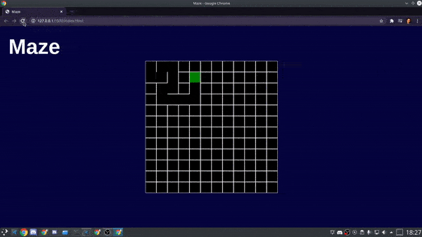

# Maze-DFS (Depth First Search)

> A maze generator that uses the DFS algorithm.

<p align=center>
  
</p>

## Running

To run this code, just clone it:

```
git clone https://github.com/William-dev1992/Maze-DFS.git
```

And run the `index.html` file.

## Contact

Feel free to contact me ;).

Linkedin: https://www.linkedin.com/in/william-ferreira-3629a61b0/

Discord: William Ferreira#0932